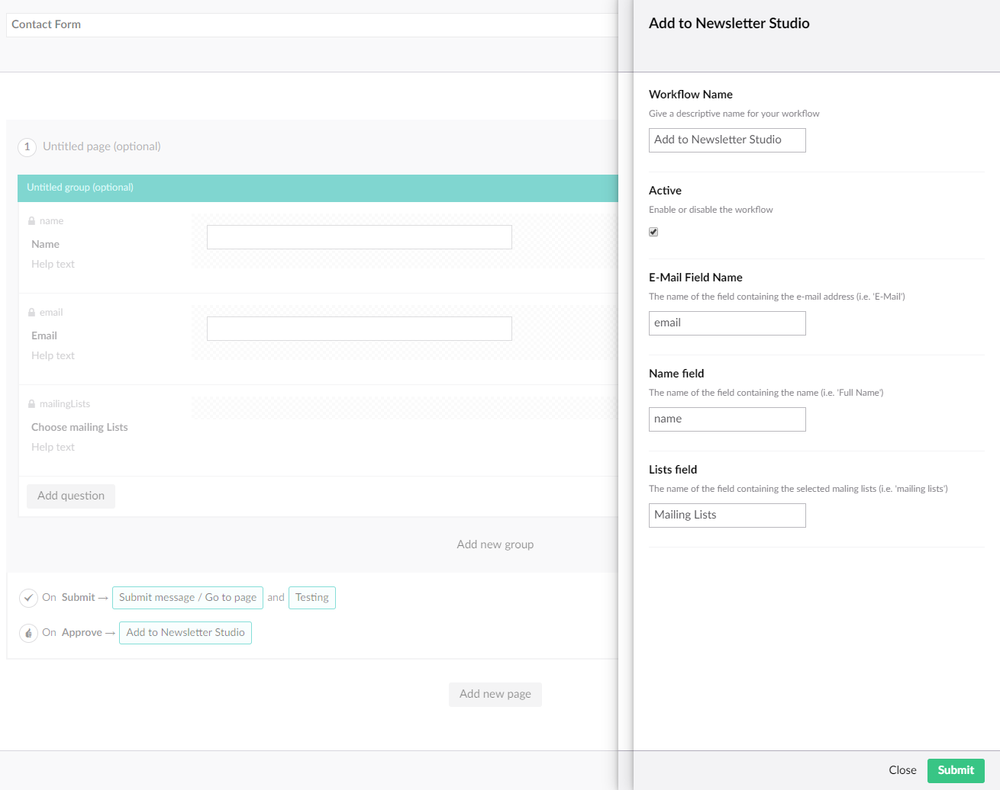
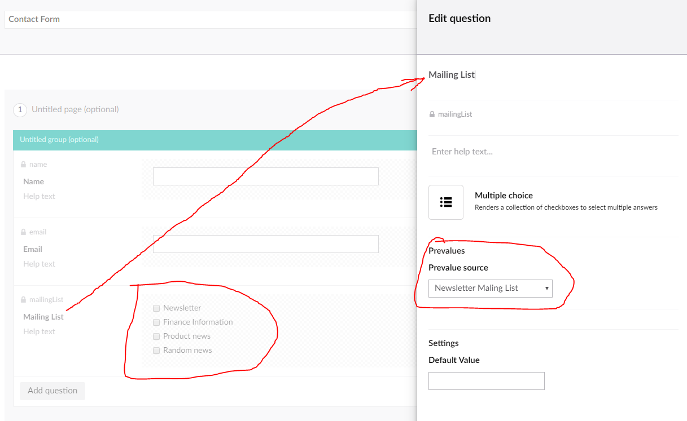
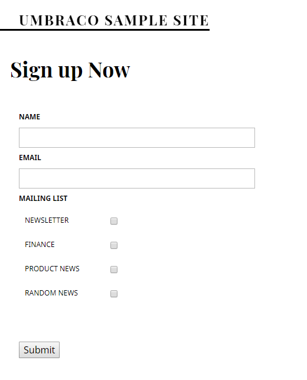

# NewsletterStudioContrib for Umbraco Forms

This part of the repository contains some extentions of Umbraco Forms that you can use with Newsletter Studio.

You could probably just "copy paste" the files and folders from the "Newsletter Studio Umbraco Forms Extentions" into your project and change namespaces.

Markus Johansson did a presentation during the Umbraco Festival in Frankfurt 2018, you can watch this here: https://slideslive.com/38907457/ninjalevel-umbraco-forms-and-some-newsletter-studio

*NOTE: This is not a complete package, it's more a form of "Inspiration" for how to extent Umbraco Forms to use it with Newsletter Studio.*

## Workflow
A workflow to be able to add a subscriber when a Umbraco Form has been submitted.

## Field Pre Value Source Type
This can be used in the accual form to make it possible to render Mailing Lists options in the form so that the visitor who fills out the form can choose which mailing lists to subscibe to.

### Configured like this:

### And rendered like this:

